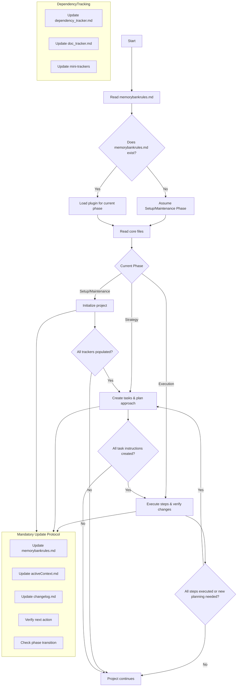

```mermaid
flowchart TD
    A[Start] --> B[Read memorybankrules.md]
    B --> C{Does memorybankrules.md exist?}
    C -- No --> D[Assume Setup/Maintenance Phase]
    C -- Yes --> E[Load plugin for current phase]
    D --> F[Read core files]
    E --> F
    F --> G{Current Phase}
    
    G -- Setup/Maintenance --> H[Initialize project]
    G -- Strategy --> I[Create tasks & plan approach]
    G -- Execution --> J[Execute steps & verify changes]
    
    H --> K{All trackers populated?}
    K -- Yes --> I
    I --> L{All task instructions created?}
    L -- Yes --> J
    J --> M{All steps executed or new planning needed?}
    M -- Yes --> I
    M -- No --> N[Project continues]
    K -- No --> N
    L -- No --> N
    
    subgraph DependencyTracking
        O[Update dependency_tracker.md]
        P[Update doc_tracker.md]
        Q[Update mini-trackers]
    end
    
    subgraph MUP[Mandatory Update Protocol]
        R[Update memorybankrules.md]
        S[Update activeContext.md]
        T[Update changelog.md]
        U[Verify next action]
        V[Check phase transition]
    end
    
    J --> MUP
    I --> MUP
    H --> MUP
    
    click B call linkCallback("f:/Cursos2/React/diagnosis/memory-bank/plugins/core_system_prompt.md")
    click D call linkCallback("f:/Cursos2/React/diagnosis/memory-bank/plugins/core_system_prompt.md")
    click E call linkCallback("f:/Cursos2/React/diagnosis/memory-bank/plugins/core_system_prompt.md")
    click F call linkCallback("f:/Cursos2/React/diagnosis/memory-bank/plugins/core_system_prompt.md")
    click G call linkCallback("f:/Cursos2/React/diagnosis/memory-bank/plugins/core_system_prompt.md")
    click H call linkCallback("f:/Cursos2/React/diagnosis/memory-bank/plugins/core_system_prompt.md")
    click I call linkCallback("f:/Cursos2/React/diagnosis/memory-bank/plugins/core_system_prompt.md")
    click J call linkCallback("f:/Cursos2/React/diagnosis/memory-bank/plugins/core_system_prompt.md")
    click MUP call linkCallback("f:/Cursos2/React/diagnosis/memory-bank/plugins/core_system_prompt.md")
```