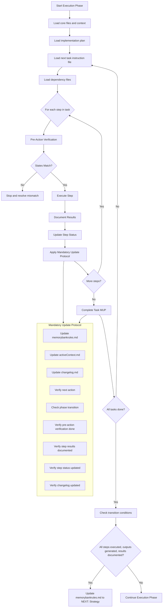

```mermaid
flowchart TD
    A[Start Execution Phase] --> B[Load core files and context]
    B --> C[Load implementation plan]
    C --> D[Load next task instruction file]
    D --> E[Load dependency files]
    E --> F{For each step in task}
    F --> G[Pre-Action Verification]
    G --> H{States Match?}
    H -- No --> I[Stop and resolve mismatch]
    H -- Yes --> J[Execute Step]
    J --> K[Document Results]
    K --> L[Update Step Status]
    L --> M[Apply Mandatory Update Protocol]
    M --> N{More steps?}
    N -- Yes --> F
    N -- No --> O[Complete Task MUP]
    O --> P{All tasks done?}
    P -- No --> D
    P -- Yes --> Q[Check transition conditions]
    Q --> R{All steps executed, outputs generated, results documented?}
    R -- Yes --> S[Update memorybankrules.md to NEXT: Strategy]
    R -- No --> T[Continue Execution Phase]

    subgraph MUPSection[Mandatory Update Protocol]
        U[Update memorybankrules.md]
        V[Update activeContext.md]
        W[Update changelog.md]
        X[Verify next action]
        Y[Check phase transition]
        Z[Verify pre-action verification done]
        AA[Verify step results documented]
        AB[Verify step status updated]
        AC[Verify changelog updated]
    end

    M --> MUPSection
    O --> MUPSection

click A call linkCallback("f:/Cursos2/React/diagnosis/memory-bank/plugins/execution_plugin.md")
click B call linkCallback("f:/Cursos2/React/diagnosis/memory-bank/plugins/execution_plugin.md")
click C call linkCallback("f:/Cursos2/React/diagnosis/memory-bank/plugins/execution_plugin.md")
click D call linkCallback("f:/Cursos2/React/diagnosis/memory-bank/plugins/execution_plugin.md")
click E call linkCallback("f:/Cursos2/React/diagnosis/memory-bank/plugins/execution_plugin.md")
click F call linkCallback("f:/Cursos2/React/diagnosis/memory-bank/plugins/execution_plugin.md")
click G call linkCallback("f:/Cursos2/React/diagnosis/memory-bank/plugins/execution_plugin.md")
click J call linkCallback("f:/Cursos2/React/diagnosis/memory-bank/plugins/execution_plugin.md")
click K call linkCallback("f:/Cursos2/React/diagnosis/memory-bank/plugins/execution_plugin.md")
click L call linkCallback("f:/Cursos2/React/diagnosis/memory-bank/plugins/execution_plugin.md")
click M call linkCallback("f:/Cursos2/React/diagnosis/memory-bank/plugins/execution_plugin.md")
click O call linkCallback("f:/Cursos2/React/diagnosis/memory-bank/plugins/execution_plugin.md")
click S call linkCallback("f:/Cursos2/React/diagnosis/memory-bank/plugins/execution_plugin.md")
click T call linkCallback("f:/Cursos2/React/diagnosis/memory-bank/plugins/execution_plugin.md")
```