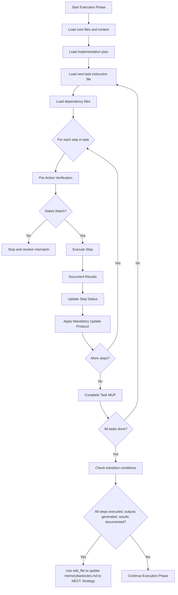

# EXECUTION PLUGIN

> ⚠️ **MANDATORY:**
> You **MUST** perform the full **Mandatory Update Protocol (MUP)** **immediately after completing every task or subtask**.
> You **MUST ACTUALLY EDIT FILES** using the write_file, edit_file, or create_directory tools.
> **Never** proceed to the next task, subtask, or phase transition **without** actually editing files.
> **DO NOT just check boxes - you must use the file editing tools to make changes.**

╔═════════════════════════════════════════════════════════════╗
║                        EXECUTION                             ║
║                                                             ║
║  Verify  -->  Execute  -->  Document  -->  Update  -->  Next ║
║  State       Step         Results       Trackers      Step   ║
╚═════════════════════════════════════════════════════════════╝

## ENTERING/EXITING THIS PHASE

**Enter if**:
- `memorybankrules.md` shows `CURRENT_PHASE: Execution`
- Transitioning from Strategy

**Exit when**:
- All steps in instruction files are executed
- Expected outputs are generated
- Results are documented

**Exit action**:
You MUST use write_file or edit_file to update memorybankrules.md with:
```
<PHASE_MARKER>
CURRENT_PHASE: Execution
NEXT_PHASE: Strategy
LAST_ACTION: Completed Execution Phase - Tasks Executed
NEXT_ACTION: Transition to Strategy Phase Instructions
REQUIRED_BEFORE_TRANSITION: User Action Required
</PHASE_MARKER>
```

## Workflow Summary


## CONTEXT LOADING

1. Read core files:
   - `memorybankrules.md`
   - `memory-bank/projectbrief.md`
   - `memory-bank/activeContext.md`
   - `memory-bank/dependency_tracker.md`
   - `memory-bank/changelog.md`

2. Load implementation plan:
   - Locate `IPx_name.md` in `memory-bank/implementation_plans`
   - Verify plan matches current task sequence
   - Follow plan's phasing and dependencies
3. Load the next task instruction file
4. Load all dependency files listed in the task instruction file

## STEP EXECUTION PROCESS

For each step in the instruction file:

1. **Pre-Action Verification** (CRITICAL)
   ```
   <VERIFICATION>
   - Intended change: [describe the change]
   - Expected state: [what you expect the file to contain]
   - Actual state: [what the file actually contains]
   - Validation: [MATCH/MISMATCH]
   </VERIFICATION>
   ```
   ❗ **PROCEED ONLY IF STATES MATCH**

2. **Execute Step**
   - Perform the specified action
   - If an error occurs, document and resolve

3. **Document Results**
   ```
   <RESULTS>
   - Action completed: [description]
   - Outcome: [what changed]
   - Observations: [notable findings]
   - Issues encountered: [any problems]
   </RESULTS>
   ```

4. **Update Step Status**
   - Use edit_file to mark step as completed in the instruction file:
     ```
     ## Steps
     1. ✅ [Step description]
     2. ⬜ [Step description]
     ```

5. **Apply MUP - ACTUAL FILE MODIFICATIONS REQUIRED**
   - Use write_file or edit_file to update `memorybankrules.md` with progress
   - Use write_file or edit_file to update `memory-bank/activeContext.md` with current status
   - Use write_file or edit_file to update `memory-bank/changelog.md` with completed steps
   - Verify all files were actually updated by reading them back

## MANDATORY FINALIZATION AFTER EACH TASK

At the **end of every task or subtask**, you **MUST**:

- Use write_file or edit_file to update all relevant files:
  - `memorybankrules.md` - Update with phase marker showing last and next actions
  - `memory-bank/activeContext.md` - Update with current state and next steps
  - `memory-bank/changelog.md` - Update with completed tasks and changes
  - Task instruction file - Update with completed steps

- After making all file edits, include the **full MUP_COMPLETED_ACTIONS block** in your response that quotes the actual text you added to each file

- **Do NOT** start a new task, subtask, or phase transition **until** you have actually modified all required files

❗ **This is critical to prevent project state gaps.**

## ERROR HANDLING PROTOCOL

When encountering errors:
1. Document the error condition
   ```
   <ERROR>
   - Error message: [exact message]
   - Context: [what you were doing]
   - Probable cause: [your analysis]
   </ERROR>
   ```

2. Determine resolution approach:
   - Retry with adjustments
   - Split into smaller steps
   - Revert and reconsider approach

3. Document resolution:
   ```
   <RESOLUTION>
   - Approach taken: [what you did]
   - Result: [outcome]
   - Preventative measures: [how to avoid this in future]
   </RESOLUTION>
   ```

4. Use write_file or edit_file to update all relevant files with error information and resolution

## SUBTASK HANDLING

When a step requires subtask execution:
1. Load subtask instruction file
2. Execute all steps in the subtask
3. Use edit_file to mark the parent task step as completed
4. Return to the parent task execution

## EXECUTION MUP - REQUIRED FILE MODIFICATIONS

After EVERY step execution, you MUST:

1. Use write_file or edit_file to update `memorybankrules.md` with:
   ```
   <PHASE_MARKER>
   CURRENT_PHASE: Execution
   NEXT_PHASE: [appropriate next phase]
   LAST_ACTION: [description of step just completed]
   NEXT_ACTION: [description of next step]
   REQUIRED_BEFORE_TRANSITION: [any requirements before transitioning]
   </PHASE_MARKER>
   ```

2. Use write_file or edit_file to update `memory-bank/activeContext.md` with:
   - Details of the step just completed
   - Current state of execution
   - Next steps to be taken

3. Use write_file or edit_file to update `memory-bank/changelog.md` with:
   ```
   ## [YYYY-MM-DD]
   - Completed: [step description]
   - Task: T{number}_{name}
   - Outcome: [result of the step]
   - Files affected: [list of files modified]
   ```

4. Use edit_file to update the task instruction file with step status:
   ```
   ## Steps
   1. ✅ [Completed step]
   2. ⬜ [Pending step]
   ```

5. After making all file modifications, verify they were applied correctly by reading files back.

## CHECKPOINTS BEFORE TRANSITION

Before transitioning to Strategy phase, use read_file to verify:
<TRANSITION_CHECKLIST>
[ ] All steps in the instruction file are executed
[ ] All expected outputs are generated
[ ] Results and observations are documented
[ ] Used edit_file to update instruction file with step status
[ ] Used write_file or edit_file to update `memorybankrules.md` with NEXT_PHASE: Strategy
</TRANSITION_CHECKLIST>

## REQUIRED RESPONSE FORMAT

All responses after completing an action MUST end with verification of actual file modifications:

<MUP_COMPLETED_ACTIONS>
I have made the following file modifications:

1. EDITED `memorybankrules.md`: [Quote the exact text you added to the file]

2. EDITED `memory-bank/activeContext.md`: [Quote the exact text you added to the file]

3. EDITED `memory-bank/changelog.md`: [Quote the exact text you added to the file]

4. EDITED `[task instruction file]`: [Quote the exact text you modified in the file]

5. EDITED ADDITIONAL FILES:
   - [filename]: [Quote the relevant text you added/edited]
   - [filename]: [Quote the relevant text you added/edited]

6. VERIFICATION: I have confirmed all files were properly updated by reading them back.

7. NEXT ACTION: [Describe exactly what will be done next]
</MUP_COMPLETED_ACTIONS>

❗ **IMPORTANT:**
Every response **after completing a task or subtask** **MUST** include the **full MUP_COMPLETED_ACTIONS block** with actual quotes from the files you modified.
If you forget, **stop immediately** and perform the file edits **before** any further actions.