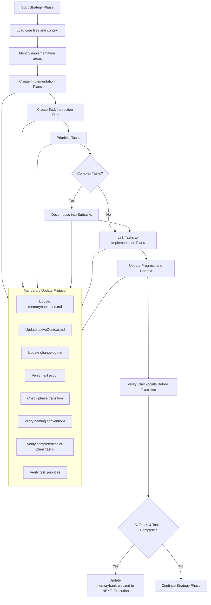

```mermaid
flowchart TD
    A[Start Strategy Phase] --> B[Load core files and context]
    B --> C[Identify implementation areas]
    C --> D[Create Implementation Plans]
    D --> E[Create Task Instruction Files]
    E --> F[Prioritize Tasks]
    F --> G{Complex Tasks?}
    G -- Yes --> H[Decompose into Subtasks]
    G -- No --> I[Link Tasks to Implementation Plans]
    H --> I
    I --> J[Update Progress and Context]
    J --> K[Verify Checkpoints Before Transition]
    K --> L{All Plans & Tasks Complete?}
    L -- Yes --> M[Update memorybankrules.md to NEXT: Execution]
    L -- No --> N[Continue Strategy Phase]

    subgraph MUP[Mandatory Update Protocol]
        O[Update memorybankrules.md]
        P[Update activeContext.md]
        Q[Update changelog.md]
        R[Verify next action]
        S[Check phase transition]
        T[Verify naming conventions]
        U[Verify completeness of plans/tasks]
        V[Verify task priorities]
    end

    D --> MUP
    E --> MUP
    F --> MUP
    H --> MUP
    I --> MUP
    J --> MUP
click A call linkCallback("f:/Cursos2/React/diagnosis/memory-bank/plugins/strategy_plugin.md")
click B call linkCallback("f:/Cursos2/React/diagnosis/memory-bank/plugins/strategy_plugin.md")
click C call linkCallback("f:/Cursos2/React/diagnosis/memory-bank/plugins/strategy_plugin.md")
click D call linkCallback("f:/Cursos2/React/diagnosis/memory-bank/plugins/strategy_plugin.md")
click E call linkCallback("f:/Cursos2/React/diagnosis/memory-bank/plugins/strategy_plugin.md")
click F call linkCallback("f:/Cursos2/React/diagnosis/memory-bank/plugins/strategy_plugin.md")
click G call linkCallback("f:/Cursos2/React/diagnosis/memory-bank/plugins/strategy_plugin.md")
click H call linkCallback("f:/Cursos2/React/diagnosis/memory-bank/plugins/strategy_plugin.md")
click I call linkCallback("f:/Cursos2/React/diagnosis/memory-bank/plugins/strategy_plugin.md")
click J call linkCallback("f:/Cursos2/React/diagnosis/memory-bank/plugins/strategy_plugin.md")
click K call linkCallback("f:/Cursos2/React/diagnosis/memory-bank/plugins/strategy_plugin.md")
click L call linkCallback("f:/Cursos2/React/diagnosis/memory-bank/plugins/strategy_plugin.md")
click M call linkCallback("f:/Cursos2/React/diagnosis/memory-bank/plugins/strategy_plugin.md")
click N call linkCallback("f:/Cursos2/React/diagnosis/memory-bank/plugins/strategy_plugin.md")
click O call linkCallback("f:/Cursos2/React/diagnosis/memory-bank/plugins/strategy_plugin.md")
click P call linkCallback("f:/Cursos2/React/diagnosis/memory-bank/plugins/strategy_plugin.md")
click Q call linkCallback("f:/Cursos2/React/diagnosis/memory-bank/plugins/strategy_plugin.md")
click R call linkCallback("f:/Cursos2/React/diagnosis/memory-bank/plugins/strategy_plugin.md")
click S call linkCallback("f:/Cursos2/React/diagnosis/memory-bank/plugins/strategy_plugin.md")
click T call linkCallback("f:/Cursos2/React/diagnosis/memory-bank/plugins/strategy_plugin.md")
click U call linkCallback("f:/Cursos2/React/diagnosis/memory-bank/plugins/strategy_plugin.md")
click V call linkCallback("f:/Cursos2/React/diagnosis/memory-bank/plugins/strategy_plugin.md")
```