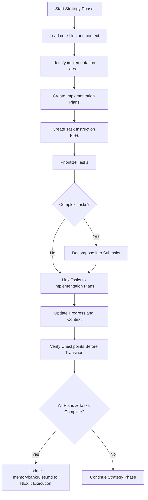

# STRATEGY PLUGIN

╔═══════════════════════════════════════════════════════════════════════════════════╗
║                                    STRATEGY                                        ║
║                                                                                   ║
║  Identify  -->  Create         -->  Create     -->  Prioritize  -->  Decompose     ║
║  Areas         Implementation      Tasks          Tasks          Complex Tasks     ║
║                Plans                                                               ║
╚═══════════════════════════════════════════════════════════════════════════════════╝

## ENTERING/EXITING THIS PHASE

**Enter if**:
- `memorybankrules.md` shows `CURRENT_PHASE: Strategy`
- Transitioning from Setup/Maintenance

**Exit when**:
- All implementation plans are created
- All instruction files are created with complete steps
- Dependencies are clearly defined
- Tasks are prioritized and ready for execution

**Exit action**:
You MUST use write_file or edit_file to update memorybankrules.md with:
```
<PHASE_MARKER>
CURRENT_PHASE: Strategy
NEXT_PHASE: Execution
LAST_ACTION: Completed Strategy Phase - Plans and Tasks Created
NEXT_ACTION: Transition to 'EXECUTION' phase
REQUIRED_BEFORE_TRANSITION: User Action Required
</PHASE_MARKER>
```

## Workflow Summary


## CONTEXT LOADING

1. Read core files:
   - `memorybankrules.md`
   - `memory-bank/projectbrief.md`
   - `memory-bank/activeContext.md`
   - `memory-bank/progress.md`
   - `memory-bank/dependency_tracker.md`

   
2. Review `activeContext.md` for current state and priorities
3. Check dependency trackers for module/file relationships
4. Review project objectives from `projectbrief.md`

## IMPLEMENTATION PLAN CREATION

❗ **PRE-IMPLEMENTATION PLAN CHECKLIST** - Complete before creating ANY implementation plan:
<IMPLEMENTATION_CHECKLIST>
[ ] 1. Plan name follows convention: IP{number}_{plan_name}
[ ] 2. Plan will be stored in memory-bank/implementation_plans/ directory
[ ] 3. Plan number is unique and sequential
[ ] 4. Plan name clearly describes the area of development
[ ] 5. All required sections are planned
</IMPLEMENTATION_CHECKLIST>

1. Identify area for implementation based on:
   - `projectbrief.md` objectives
   - `activeContext.md` priorities
   - System architecture and components

2. Use write_file or create_directory to create implementation plan directory if it doesn't exist:
   ```
   memory-bank/implementation_plans/
   ```

3. Use write_file to create implementation plan file with correct naming convention:
   ```
   memory-bank/implementation_plans/IP{number}_{plan_name}.md
   ```
   For example: `memory-bank/implementation_plans/IP1_UserDashboard.md`
   
   ❗ **CRITICAL**: ALL implementation plans MUST be stored in the `memory-bank/implementation_plans/` directory

4. Implementation plan should follow this template:
   ```
   # IP{number}_{plan_name}
   
   ## Overview
   [High-level description of implementation area]
   
   ## Goals
   - [Goal 1]
   - [Goal 2]
   
   ## Components
   - [Component 1]
   - [Component 2]
   
   ## Technical Approach
   [Description of technical approach]
   
   ## Related Tasks
   - T{number}_{task_name} - [Brief description]
   - T{number}_{task_name} - [Brief description]
   
   ## Timeline
   - [Phase 1]
   - [Phase 2]
   
   ## Risks and Mitigations
   - [Risk 1]: [Mitigation 1]
   - [Risk 2]: [Mitigation 2]
   ```

5. After creating the implementation plan, use write_file or edit_file to update `memory-bank/progress.md`:
   ```
   ## Implementation Plans
   - IP1_UserDashboard: 0% (not started)
   
   ## Related Tasks
   - T1_DashboardLayout: 0% (not started) - [IP1]
   - T2_DashboardWidgets: 0% (not started) - [IP1]
   ```

## TASK INSTRUCTION FILE CREATION

❗ **PRE-TASK CREATION CHECKLIST** - Complete before creating ANY task file:
<TASK_CHECKLIST>
[ ] 1. Task name follows convention: T{number}_{task_name}
[ ] 2. Task will be stored in memory-bank/tasks/ directory
[ ] 3. Task number is unique and sequential
[ ] 4. Task name clearly describes the purpose
[ ] 5. Implementation plan is referenced (if applicable)
[ ] 6. All required sections are planned
</TASK_CHECKLIST>

1. Identify task/subtask based on:
   - `projectbrief.md` objectives
   - `activeContext.md` priorities
   - Dependencies from trackers
   - Implementation plans (reference parent plan)

2. Use write_file or create_directory to create tasks directory if it doesn't exist:
   ```
   memory-bank/tasks/
   ```

3. Use write_file to create file with correct naming convention in the dedicated tasks directory:
   ```
   memory-bank/tasks/T{number}_{task_name}_instructions.txt
   ```
   For example: `memory-bank/tasks/T1_DashboardLayout_instructions.txt`
   
   ❗ **CRITICAL**: ALL task files MUST be stored in the `memory-bank/tasks/` directory

4. Task instruction file should follow this template:
   ```
   # T{number}_{task_name} Instructions
   
   ## Objective
   [Clear statement of purpose]
   
   ## Context
   [Background information]
   [Implementation Plan: IP{number}_{plan_name}]
   
   ## Dependencies
   [List of required modules/files with keys]
   
   ## Steps
   1. [First step]
   2. [Second step]
   ...
   
   ## Expected Output
   [Description of deliverables]
   
   ## Notes
   [Additional considerations]
   ```

5. After creating the task instruction file, use write_file or edit_file to update `memory-bank/progress.md`:
   ```
   ## Task Completion
   - T1_DashboardLayout: 0% (not started) [IP1_UserDashboard]
   - T2_DashboardWidgets: 0% (not started) [IP1_UserDashboard]
   
   ## Next Major Milestones
   1. Begin execution of highest priority task
   ```

## TASK PRIORITIZATION

1. Review existing implementation plans and instruction files
2. Assess dependencies from trackers to identify prerequisite tasks
3. Align with project objectives from `projectbrief.md`
4. Consider recent priorities from `activeContext.md`
5. Use write_file or edit_file to update both files:

   First update `memory-bank/activeContext.md` with prioritization reasoning.
   
   Then update `memory-bank/progress.md` with:
   ```
   ## Task Tracking
   
   ### Implementation Plan Locations
   - IP1_UserDashboard: memory-bank/implementation_plans/IP1_UserDashboard.md
   - IP2_UserProfile: memory-bank/implementation_plans/IP2_UserProfile.md
   
   ### Task Locations
   - T1_DashboardLayout: memory-bank/tasks/T1_DashboardLayout_instructions.txt [IP1]
   - T2_DashboardWidgets: memory-bank/tasks/T2_DashboardWidgets_instructions.txt [IP1]
   - T3_ProfileSettings: memory-bank/tasks/T3_ProfileSettings_instructions.txt [IP2]
   
   ### Task Priorities
   1. T1_DashboardLayout (Highest) - Required for all dashboard work [IP1]
   2. T3_ProfileSettings (High) - Security requirement [IP2]
   3. T2_DashboardWidgets (Medium) - Can be started after layout [IP1]
   ```

## RECURSIVE TASK DECOMPOSITION

For complex tasks:
1. Analyze complexity and scope
2. If too large, identify logical subtasks
3. Use write_file to create instruction file for each subtask following naming convention:
   ```
   memory-bank/tasks/T{parent_number}_{parent_name}_ST{subtask_number}_{subtask_name}_instructions.txt
   ```
   For example: `memory-bank/tasks/T1_DashboardLayout_ST1_GridSystem_instructions.txt`

4. Define dependencies between subtasks
5. Use edit_file to update parent task to reference subtasks
6. Use edit_file to update `memory-bank/activeContext.md` with decomposition reasoning and reference parent implementation plan

## STRATEGY MUP (MANDATORY FILE UPDATES)

After EVERY significant action in the Strategy phase, you MUST:

1. Use write_file or edit_file to update `memorybankrules.md` with:
   ```
   <PHASE_MARKER>
   CURRENT_PHASE: Strategy
   NEXT_PHASE: [appropriate next phase]
   LAST_ACTION: [description of what you just did]
   NEXT_ACTION: [description of what should be done next]
   REQUIRED_BEFORE_TRANSITION: [any requirements before transitioning]
   </PHASE_MARKER>
   ```

2. Use write_file or edit_file to update `memory-bank/activeContext.md` with:
   - What was just completed
   - Current state of strategy planning
   - Next steps or tasks

3. Use write_file or edit_file to update `memory-bank/changelog.md` with:
   ```
   ## [YYYY-MM-DD]
   - Created implementation plan: IP{number}_{name}
   - Created task: T{number}_{name}
   - Reason: [Reason for change]
   - Affected files: [List of affected files]
   ```

4. After making all file updates, verify proper updates by reading files back.

## CHECKPOINTS BEFORE TRANSITION

Before transitioning to Execution phase, verify:
<TRANSITION_CHECKLIST>
[ ] All identified implementation areas have implementation plans
[ ] All identified tasks have instruction files
[ ] All implementation plans and instruction files have complete sections
[ ] Tasks are linked to their implementation plans
[ ] Dependencies are clearly specified
[ ] Task priorities are documented
[ ] Complex tasks are decomposed if needed
[ ] Used edit_file or write_file to update `memorybankrules.md` with NEXT_PHASE: Execution
</TRANSITION_CHECKLIST>

## REQUIRED RESPONSE FORMAT

All responses after completing an action MUST end with verification of actual file modifications:

<MUP_COMPLETED_ACTIONS>
I have made the following file modifications:

1. EDITED `memorybankrules.md`: [Quote the exact text you added to the file]

2. EDITED `memory-bank/activeContext.md`: [Quote the exact text you added to the file]

3. EDITED `memory-bank/changelog.md`: [Quote the exact text you added to the file or "No significant changes to record"]

4. EDITED ADDITIONAL FILES:
   - [filename]: [Quote the relevant text you added/edited]
   - [filename]: [Quote the relevant text you added/edited]

5. VERIFICATION: I have confirmed all files were properly updated by reading them back.

6. NEXT ACTION: [Describe exactly what will be done next]
</MUP_COMPLETED_ACTIONS>